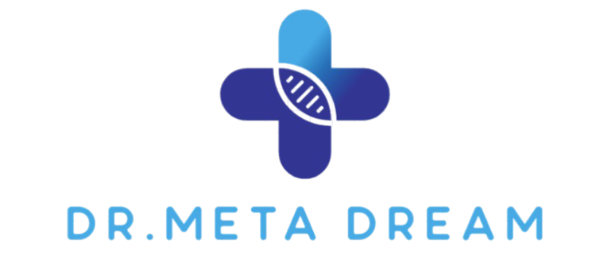
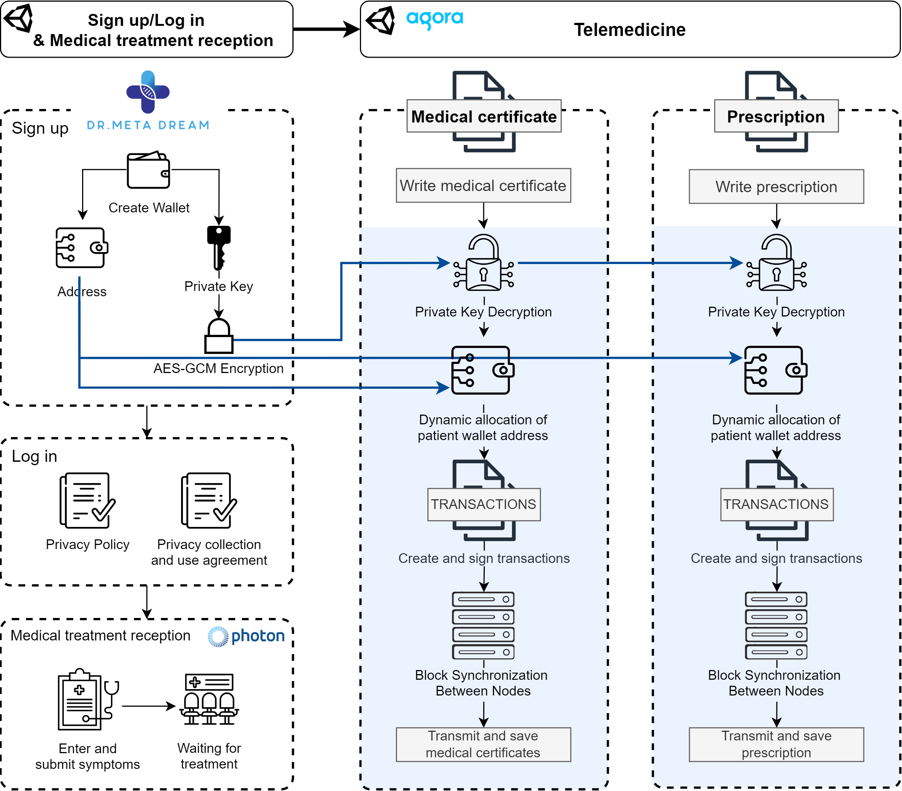
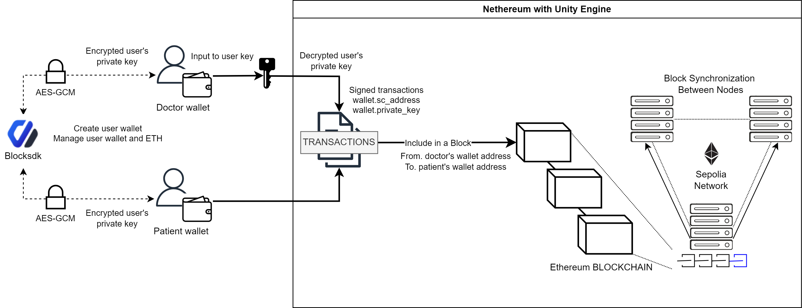

# Dr.MetaDream

     

### :movie_camera: Demonstration video : https://www.youtube.com/watch?v=xD4C78X9o6c

# :books: Contents
- [:book: Project Introduction](#book-Project-Introduction)
  - [Project Outline](#Project-Outline)
  - [Project Objective](#Project-Objective)
- [🏥 Platform Configuration](#🏥-Platform-Configuration)
  - [Platform Flow](#Platform-Flow)
  - [🖥️ Unity](#🖥️-Unity)
  - [⛓️ Blockchain](#⛓️-Blockchain)
  - [⚖️ Privacy Policy (개인정보처리방침)](#⚖️-Privacy-Policy-(개인정보처리방침))
- [⭐ Team Information](#⭐-Team-Information)

# :book: Project Introduction

## Project Outline
팬데믹 기간 동안 원격 진료 전화 건수가 230%가 증가하였다. 이는 원격 진료에 대한 수요의 증가를 나타낸다. 원격 진료에 대한 수요가 증가하면서 그 필요성도 함께 강조되고 있다. 원격 진료는 비용과 이동 및 불필요한 대기 시간을 절약할 수 있으며, 의료 서비스의 접근성을 향상시킨다.  특히 만성질환 관리를 개선하고 의료 취약지 및 지방에서 중요한 의료 서비스 대안으로 자리 잡고 있다. 감염병 확산을 방지하고 효율적인 환자 선별과 격리를 지원하는 데도 큰 역할을 하고 있다.

## Project Objective
1. 메타버스 기술을 적용한 플랫폼은 의료 취약지 및 도서 벽지 환자들에게 원격 진료 환경을 제공하여 의료 접근성 향상을 기대할 수 있다.
2. 플랫폼에 블록체인 기술을 적용함으로써 의사와 환자 간 진료 기록의 안전한 관리, 불법 행위 및 불공정 거래 예방, 데이터 유출 및 조작 위험 최소화를 플랫폼 내에서 실현할 수 있다. 이를 통해 데이터 신뢰성을 강화하고 거래의 투명성과 안정성을 확보하고자 한다. 
3. 거래의 공정성 확보 방안 제시, 개인정보 및 의료 데이터 보호 방안 제안하여 원격 진료의 공정성 및 제도화 촉진을 기대할 수 있다.

# 🏥 Platform Configuration

## Platform Flow

### (1) Sign up & Login
회원가입 시 사용자별 지갑 생성(지갑 주소, Private key) 이후 사용자의 Private key를 AES-GCM 암호화하여 서버에서 계정을 관리한다. 또한 본 플랫폼에서 이용 및 처리하고 있는 사용자의 정보를 개인정보처리방침을 통해 안내한다.

### (2) Patient
1. 증상 입력 및 접수
2. 원격 진료실 입장 팝업 생성
3. 진료실 입장 및 원격 진료
4. 작성된 진단서 및 처방전 확인

### (3) Doctor
1. 환자 접수 대기 목록 확인
2. 환자에게 진료실 입장 요청 전송
3. 원격 진료: 진단서 & 처방전
   - 진단서 & 처방전 작성
   - Private key 복호화
     - 진단서: 의사에게 암호화 키 입력 요청
     - 처방전: 진단서 작성 시 입력한 암호화 키를 가져와 백그라운드에서 복호화 진행
   - 트랜잭션 생성 및 서명
     - 의사의 지갑 주소 및 복호화된 Private key와 현재 작성된 대상 환자의 지갑 주소로 동적 할당
     - 작성된 진단서 & 처방전 데이터가 포함된 각각의 트랜잭션 생성
   - 진단서 & 처방전 블록 생성
   - 진단서 & 처방전 데이터 서버로 전송 및 저장

## 🖥️ Unity
|                             Tool                             | Description     |
| :----------------------------------------------------------: | --------------- |
|         | Photon 기술을 활용하여 다수의 사용자가 동시에 플랫폼에 접속하고 상호작용할 수 있는 환경을 구현했다. 이를 통해 다수의 환자와 의사가 실시간으로 연결될 수 있으며 Photon의 네트워크 최적화 기능은 안정적인 실시간 통신 환경을 제공한다. |
|          | 화상 진료를 위한 Agora SDK를 도입하여 환자와 의사가 고품질의 화상 통화를 통해 원활한 진료를 진행할 수 있도록 한다.  |

## ⛓️ Blockchain
### Blockchain

1. 회원가입 시 사용자의 회원가입 정보를 기반으로 BlockSDK를 통해 사용자별 개인 자격 증명 생성(지갑 주소 및 Private key)
2. 사용자에게 암호화 키를 받아서 Private key AES-GCM 암호화 진행
3. 가입자 정보와 지갑 주소, 암호화된 Private Key를 서버에 저장 및 관리
4. 트랜잭션 생성 및 블록 생성
   - 진단서 및 처방전 생성 시 암호화 키 입력 요청
   - 사용자 Private key AES-GCM 복호화 진행
   - 의사의 지갑 주소와 Private key로 트랜잭션 서명
   - 대상 환자의 지갑 주소를 동적 할당
   - 진단서 및 처방전 데이터에 대한 트랜잭션 생성
5. 이더리움 테스트넷 블록체인에 블록 생성
   - 블록 내 트랜잭션이 일정 데이터 이상 저장되면 다음 블록이 생성되면서 블록체인 형성
   - 세폴리아 네트워크 내 하나의 노드에 생성된 블록 체인이 다른 노드 간 동기화로 블록 체인 생성

## ⚖️ Privacy Policy (개인정보처리방침)
- 원격 의료 플랫폼에서는 민감정보와 고유식별정보를 처리해야 하므로 법적 근거를 명시한 처리 방침이 매우 중요하다.
- 개인정보처리방침은 의료법 시행령을 포함하고 있으며, 원격 의료 서비스를 제공하기 위해 민감정보(예: 병력, 증상) 및 고유식별정보(예: 주민등록번호)를 수집하는 법적 정당성을 명시한다.
- 메타버스와 블록체인에서 활용되는 개인정보 처리 항목을 명시함으로써 사용자에게 더욱 안전하고 신뢰성 있는 메타버스 서비스를 제공한다.

# ⭐ Team Information
|  |  |  |  |  |
| ------ | ---------------- | ---------------- | ---------------- | ---------------- |
| 
 <a href="https://github.com/usgnim">김수민 
 | 
 <a href="https://github.com/H4R4n9">김민성 
 | 
 <a href="https://github.com/ssungg">이성민 
 | 
 <a href="https://github.com/Chaeeun03">이채은 
 | 
 <a href="https://github.com/dhtpgml">오세희 
 |
